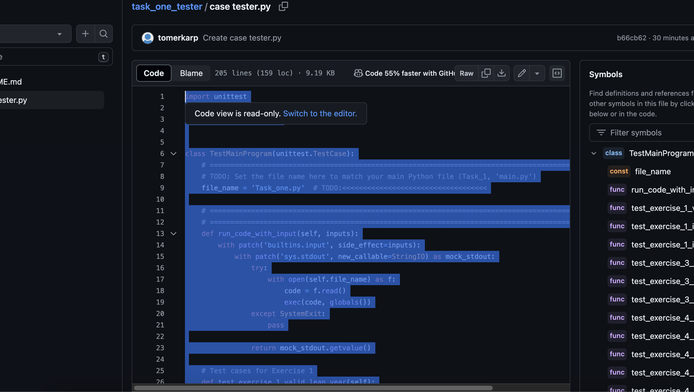
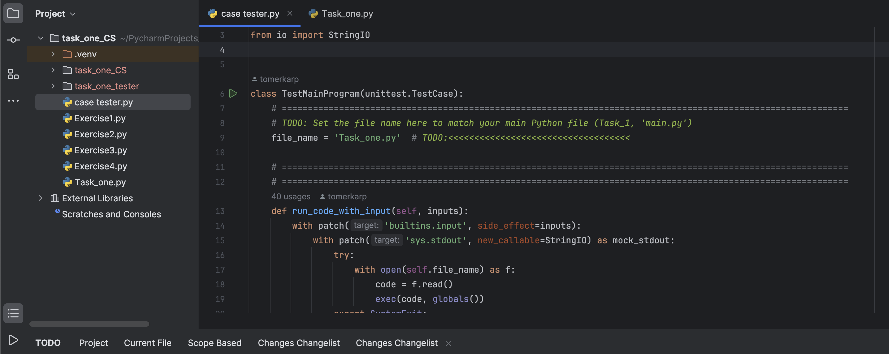
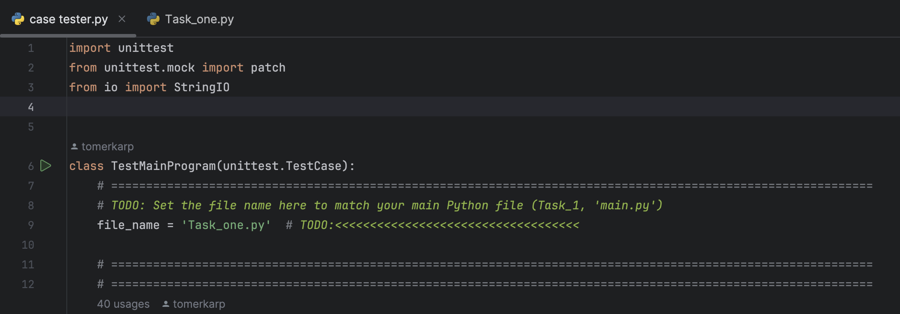

# tester


## התקנה
צריך ליצור קובץ פייטון חדש בפרויקט



ולהעתיק את הקוד לקובץ חדש בתוך אותו פרויקט בפייצ׳רם




## שינוי השם של הקובץ הראשי



במיקום של השם של הקובץ צריך לשנות לשם של הקובץ הגשה שלכם
```bash
# under the first TODO 
file_name = '______' #your finale file name 
```


