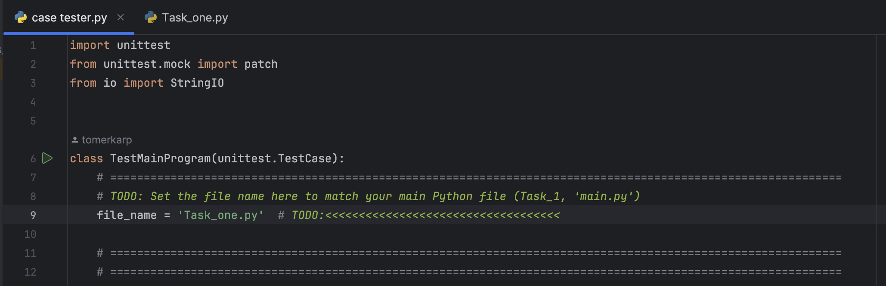
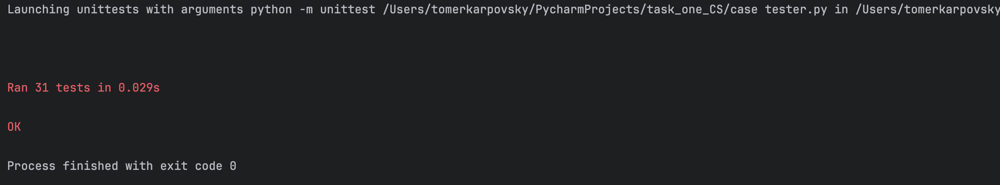
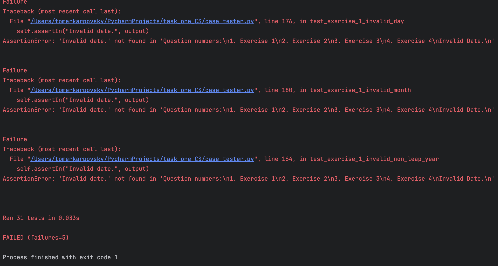

# tester


## התקנה
צריך ליצור קובץ פייטון חדש בפרויקט
ולהעתיק את הקוד לקובץ חדש בתוך אותו פרויקט בפייצ׳רם


שיראה בסוף כך


## שינוי השם של הקובץ הראשי



במיקום של השם של הקובץ צריך לשנות לשם של הקובץ הגשה שלכם
```bash
# under the first TODO 
file_name = '______' #your finale file name 
```
## דוגמאות

הרצה תקינה:



הרצה לא תקינה:


היו 5 נסיונות לא תקינים הטעות הייתה

"Invalid Date." במקום "Invalid date."